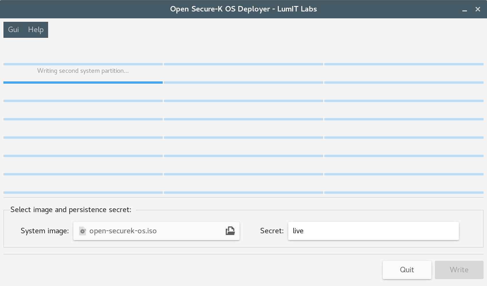

Open Secure-K OS Deployer
=========================

**Open Secure-K OS** (https://github.com/LumIT-Labs/open-securekos) is a **liveng**-compliant (https://liveng.readthedocs.io) operating system built using Linux Debian components. 

**Open Secure-K OS Deployer** is the deployment system for writing the Open Secure-K OS initial ISO image onto a USB key - it will create the **liveng partitioning scheme**.

Open Secure-K OS and Open Secure-K OS Deployer are **LumIT Labs** projects.

Installation (Debian Stretch/GNOME)
^^^^^^^^^^^^^^^^^^^^^^^^^^^^^^^^^^^

You can download the binary package from Releases, https://github.com/LumIT-Labs/open-securekos-deployer/releases.

In order to install it into the system, open the terminal emulator as root::

    dpkg -i open-securekos-deployer_version-release_all.deb
    apt-get update
    apt-get install -f

Only Debian Stretch with GNOME is supported or has been tested.

Usage
^^^^^

Once installed, open the Deployer as you normally do for a GNOME program, select the Open Secure-K OS initial ISO image file and type in a passphrase of your choice for **LUKS-encrypting the data persistence partition**, then click on Write. The Deployer will deploy the Open Secure-K OS initial ISO image onto all the insterted (and listed) USB devices, thus creating the complete Open Secure-K OS liveng operating system.

You can also launch the Python script via a terminal emulator in order to see its log messages::

    cd /usr/lib/open-securekos-deployer-<majorVersion>
    echo "logorroic:true" > deployer.cfg
    python deployer.pyc

Advanced
^^^^^^^^

Openbox note (if using a Debian Stretch derived distro without GNOME for the deployment): unline GNOME, Openbox seems to automount every USB device every time it's created. So, make sure the the automount is disabled.

Building (Debian Stretch)
^^^^^^^^^^^^^^^^^^^^^^^^^

The Open Secure-K OS Deployer codebase comes with a quick-and-dirty Debian Stretch package builder - only the binary .deb package is built. 

In order to build the Debian package, open the terminal emulator as root::

    cd /path/to/open-securekos-deployer/source
    ./debian-pkg/make-release.sh

The *open-securekos-deployer_version-release_all.deb* file will be created. 

